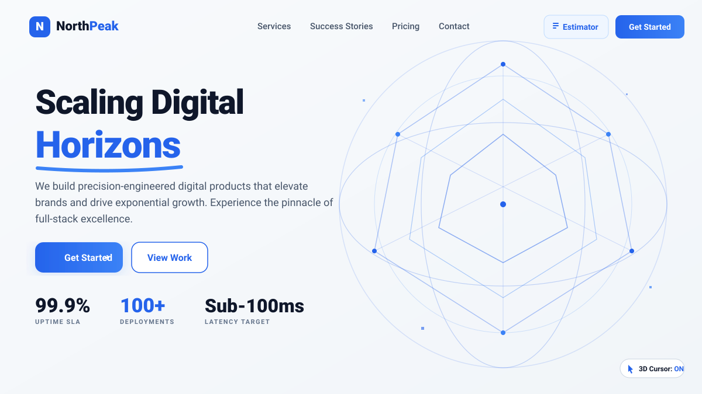

# NorthPeak Digital

> High-Performance Web Development & Digital Engineering Platform

NorthPeak Digital is a flagship web experience built for modern enterprise clients. Designed with a clean, tech-forward aesthetic, it showcases high-performance digital engineering services, interactive project cost estimation, real client case studies, and complete web accessibility & SEO optimizations.

---

## 🌐 Live Demo & Repository

- **Live Demo**: [https://northpeak.digital](https://ais-pre-hio4abzpoyk4ry4icz56ho-698555391304.asia-southeast1.run.app)
- **GitHub Repository**: [https://github.com/northpeak-digital/northpeak-web](https://github.com/northpeak-digital/northpeak-web)

---

## 🖼️ Application Preview



---

## ✨ Features

- **Interactive Project Estimator**: Instant budget and timeline calculator tailored to client scope requirements.
- **Service & Case Study Deep Dives**: Rich interactive modal dialogs detailing enterprise capabilities and actual case studies.
- **Full Keyboard Accessibility**: Built with WCAG AA compliance, proper ARIA labels, focus rings, and full `Tab` / `Enter` keyboard navigation.
- **Media & Image Optimization**: Native image lazy loading (`loading="lazy"`) and asynchronous decoding (`decoding="async"`).
- **SEO & Social Sharing Ready**: Includes full Open Graph, Twitter Cards, `robots.txt`, `sitemap.xml`, canonical URLs, and custom vector favicon.
- **Responsive Fluid Architecture**: Flawlessly adapts across mobile devices (360px), tablets, and high-resolution desktop displays (1440px+).

---

## 🛠️ Tech Stack

- **Framework & Language**: [React 18](https://react.dev/), [TypeScript](https://www.typescriptlang.org/)
- **Build Tooling**: [Vite](https://vitejs.dev/)
- **Styling**: [Tailwind CSS](https://tailwindcss.com/)
- **Iconography**: [Lucide React](https://lucide.dev/)
- **Animations**: [Motion](https://motion.dev/)
- **Quality Assurance**: TypeScript Compiler (`tsc --noEmit`), ESLint

---

## 🚀 Installation & Local Development

1. **Clone the Repository**
   ```bash
   git clone https://github.com/northpeak-digital/northpeak-web.git
   cd northpeak-web
   ```

2. **Install Dependencies**
   ```bash
   npm install
   ```

3. **Start Development Server**
   ```bash
   npm run dev
   ```
   Navigates to `http://localhost:3000`.

4. **Build for Production**
   ```bash
   npm run build
   ```

5. **Deploy to Vercel**
   - Connect your GitHub repository (`northpeak-digital/northpeak-web`) to [Vercel](https://vercel.com/).
   - Select **Vite** as the framework preset (Build Command: `npm run build`, Output Directory: `dist`).
   - `vercel.json` will automatically configure URL rewrites for Single Page Application routing.

6. **Linting & Type Checking**
   ```bash
   npm run lint
   ```

---

## 📁 Folder Structure

```
northpeak-web/
├── public/
│   ├── favicon.svg              # Custom brand SVG favicon
│   ├── robots.txt               # Search crawler permissions
│   └── sitemap.xml              # XML site map for SEO
├── src/
│   ├── components/
│   │   ├── CaseStudyModal.tsx   # Detailed client case study modal
│   │   ├── Contact.tsx          # Contact form and office locator
│   │   ├── Footer.tsx           # Global footer with social links
│   │   ├── Hero.tsx             # Primary visual hero section
│   │   ├── Navbar.tsx           # Responsive navigation header
│   │   ├── PrecisionDetail.tsx  # High-impact engineering showcase
│   │   ├── Pricing.tsx          # Engagement tier breakdown
│   │   ├── ProjectEstimatorModal.tsx # Interactive scope calculator
│   │   ├── ServiceDetailModal.tsx # Detailed service offering modal
│   │   ├── Services.tsx         # Bento grid of core services
│   │   └── Testimonials.tsx     # Client reviews and quotes
│   ├── App.tsx                  # Main application container
│   ├── index.css                # Tailwind CSS imports & custom styles
│   ├── main.tsx                 # React DOM root mounting
│   └── types.ts                 # Centralized TypeScript interfaces
├── index.html                   # HTML entry point with complete SEO metadata
├── metadata.json                # Applet configuration metadata
├── optimization-changelog.md    # Performance & accessibility log
├── package.json                 # Project dependencies & npm scripts
├── tsconfig.json                # TypeScript compiler config
└── vite.config.ts               # Vite configuration
```

---

## 🙌 Credits

- **Design Inspiration**: Modern digital engineering and high-contrast enterprise design aesthetics.
- **Imagery**: High-quality imagery provided via [Unsplash](https://unsplash.com/).
- **Iconography**: Clean UI icon set provided by [Lucide React](https://lucide.dev/).

---

## 🤖 AI Usage & Pair-Programming Disclosure

AI tools—including **Google AI Studio** with Gemini models, **ChatGPT** for prompt structuring, and **Google Stitch** for UI/UX design concepts—were used during brainstorming, UI ideation, prompt engineering, debugging, and performance optimization. All design decisions, implementation, testing, and final code review were completed manually, with modifications made to ensure the project reflects my own understanding and approach.
